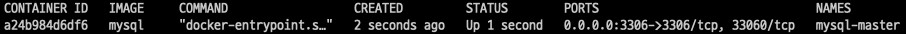

# MySQL Replica sample
### 목표
- 커맨드 요청은 Master에서 처리
- 쿼리 요청은 Slave에서 처리
### 환경
- docker
- mysql

## 실습순서

### 1. MySQL DB Master, Slave 구조만들기
1. docker mysql image 설치
   ```
   docker pull mysql
   ```
2. master docker image run
   ```
   docker run -d -p 3306:3306 -e MYSQL_ROOT_PASSWORD=1234 --name mysql-master mysql
   ```
   
3. master setting
   ```shell
   docker exec -it mysql-master /bin/bash
   microdnf install -y vim #설정정보 수정을 위해 vim 설치
    
   #vim /etc/my.cnf 설정파일에 아래 두줄 추가
   log-bin=mysql-bin
   server-id=1   
   
   #docker 컨테이너 재시작
   docker restart mysql-master
   
   #설정 변경 확인
   mysql -u root -p
   mysql> SHOW MASTER STATUS\G
   ```
   - log-bin : Binary log 설정 파일 세팅
   - server-id : 서버를 식별하기 위한 고유 ID

4. master DB setting
   ```shell
   CREATE USER 'sample-user'@'%';
  
   ALTER USER 'sample-user'@'%' IDENTIFIED BY '1234';
   
   GRANT REPLICATION SLAVE ON *.* TO 'sample-user'@'%';
   
   FLUSH PRIVILEGES;
   ```
5. slave setting
   ```shell
   #slave docker run
   docker run -d -p 3307:3306 -e MYSQL_ROOT_PASSWORD=1234 --link mysql-master --name mysql-slave mysql
   
   docker exec -it mysql-slave /bin/bash
   microdnf install -y vim #설정정보 수정을 위해 vim 설치
    
   #vim /etc/my.cnf 설정파일에 아래 두줄 추가
   log-bin=mysql-bin
   server-id=2   
   
   #docker 컨테이너 재시작
   docker restart mysql-slave
   
   #설정 변경 확인
   mysql -u root -p
   mysql> SHOW MASTER STATUS\G
   ```
   - --link 옵션은 컨테이너 이름을 통해 host주소를 사용하기 위한 옵션
6. slave, master connect
   ```shell
   #============mysql-master============
   #sample database 생성
   CREATE DATABASE sample;
   USE sample;
   
   #sample table 생성
   CREATE TABLE samples (
   id bigint NOT NULL AUTO_INCREMENT,
   name varchar(20) DEFAULT NULL,
   PRIMARY KEY(id)
   );
   
   #sample data 생성
   INSERT INTO samples VALUES('test record');
   
   #master log reset
   RESET MASTER;
   
   #master status check(file, position은 따로 기록->slave에서 필요)
   SHOW MASTER STATUS;
   
   #sample database dump 생성
   mysqldump -u root -p sample > sample-dump.sql;
   
   #dump파일 slave로 복사
   docker cp mysql-master:/root/sample-dump.sql . 
   docker cp sample-dump.sql mysql-slave:/root/
   
   #============mysql-slave============
   mysql -u root -p
   
   #sample database 생성
   CREATE DATABASE sample;
   
   #dump 적용
   mysql -u root -p sample < /root/sample-dump.sql
   
   #dump 확인
   USE sample;
   select * from samples;
   
   #연결
   CHANGE REPLICATION SOURCE TO \
   SOURCE_HOST='mysql-master', \
   SOURCE_PORT=3306, \
   SOURCE_USER='sample-user', \
   SOURCE_PASSWORD='1234', \
   SOURCE_LOG_FILE='mysql-bin.000001', \
   SOURCE_LOG_POS=157,\
   SOURCE_SSL=1;
   # START
   START REPLICA;
   ```
   - stop replica;
     - replica 중지
   - reset replica all;
     - replica 설정 초기화

> 🔍 POS가 다를 경우 master 연결이 안됨 !!!!!!!!!!!!!!!

> Master dump 작업 후 pos를 기록하고 slave 연결 작업전 master의 데이터가 변경(pos값이 변경)
> 작업이 진행이 안되서 slave database 삭제 후 새로운 dump 후 새로운 pos 값으로 설정
7. 확인
```shell
#master
INSERT INTO samples VALUES('test 3');

SELECT * FROM samples;

#slave
SELECT * FROM samples; #데이터가 추가되어있다!!!!
```
### 2. Application에서 CUD작업은 Master, Q작업은 Slave 세팅
